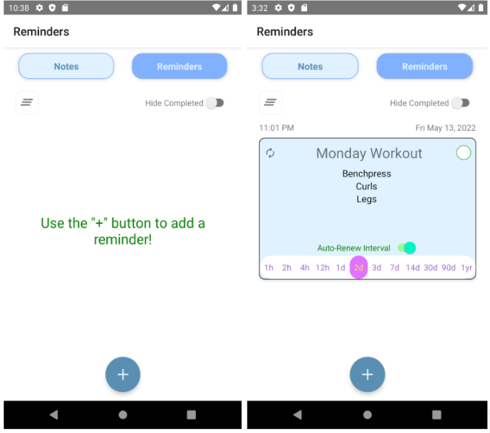

##### Smart Reminder mobile application built on the React Native framework, which allows for cross-platform mobile development using Javascript.

## Table of contents
* [General info](#general-info)
* [GUI Preview](#gui-preview)
* [Technologies](#technologies)
* [Setup](#setup)


## General info
Xenote allows the user to create reminders that have subtasks. Each subtask can be set to notify the user when its deadline is reached via push notifications. This helps the user to not rely only on the final deadline, but to complete the tasks in small stages and gradually. This arrangement also provides a simple logical grouping that allows the user to easily list items that need to be remembered, such as project tasks, workouts, birthdays, shopping lists, etc. There is also a “simple notes” page that is easily toggled that creates notes with a title, subject, body, and priority. These notes can be “flagged” as well.
Navigation is simple and intuitive. All items are edited using long presses. On the top-level screen, the user can select between Notes & Reminders. A long-press on a reminder card brings the user into the settings for the reminder and creation of subtasks. Long-pressing a subtask allows editing in a pop-up window. Reminders and subtasks both can be scheduled with push notifications. Notes are also edited with a long press. All items can be deleted with a left swipe, and notifications are set with a right swipe. Notes can be flagged to indicate urgency, pinned to the top of the list, sorted by priority or other features..


## GUI Preview
This app allows you to create reminders that have subtasks. Each subtask notifies the user when its deadline is reached. When the Add button on the main screen is pressed the reminder is created and the user is automatically brought to the second screen, where they can edit the subtasks. The screen toggle lets the users easily access reminders and notes from the same screen for ease of use. On the new subtask screen users can make multiple tasks with their own time and date for completion and then click on date and time icons to set the final reminder for all the tasks. After Reminder is created, notifications will be automatically triggered once the due date is reached, but users have an option to cancel those using the cancel push notification button on the left side of the main screen. It is easy to switch to the notes screens where users can add new notes and set priority for each of them. Notes are sorted by priority but pinned notes will always be shown on the top regardless of their priority. Long press on list will bring users to the edit screen to update their notes or reminder tasks. Left swipe on the list acts as a delete method for both notes and reminders while right swipe only works on reminder subtasks to turn their notifications on.
### Reminders List Mian Screen



### Add New Reminder Screen


### Add New Subtask Screen


### Notes Main Screen


### New Note Screen


## Technologies
Project is created with:
* React Native
* React.js
* TypeScript
* npm/yarn
	
## Setup
```
System
    Linux/Windows Environment (Windows / Windows Linux Subsystem or Any Another Linux Distro)

Andriod Studio
    Android Emulator should be instaled to view the app on virtual device

React Native
    React native should be installed on the user device to run the project natively 


npm/yarn packages (to install the required packages run the command in terminal before running the project)
  npm / yarn install 
```

 
#### Run Project: (\Subscrap)
```
$ npx react-native start
and then
$ npx react-native run-android

```

#### Gradle troubleshooting (only if getting gradle related error)

```
Inside "android/gradle/wrapper/gradle-wrapper.properties"

** Local version **

distributionBase=GRADLE_USER_HOME
distributionPath=wrapper/dists
distributionUrl=file\:///S:\Installers/gradle-7.4-all.zip
zipStoreBase=GRADLE_USER_HOME
zipStorePath=wrapper/dists

** Replace with **

distributionBase=GRADLE_USER_HOME
distributionPath=wrapper/dists
[(distributionUrl=https\://services.gradle.org/distributions/gradle-7.4-all.zip)]
zipStoreBase=GRADLE_USER_HOME
zipStorePath=wrapper/dists
```
